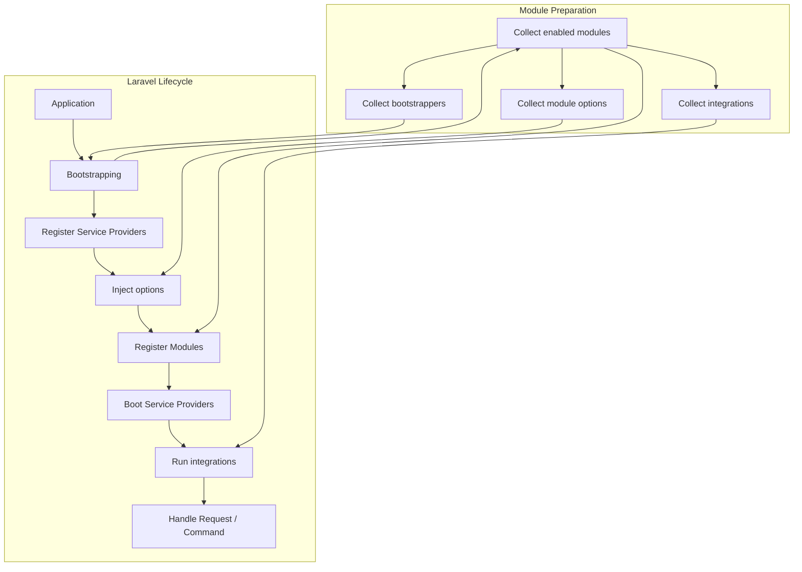
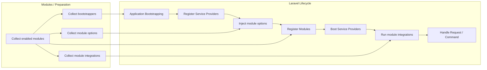

Epsicube introduces a multi-stage lifecycle for both modules and cores. Each module goes through the following phases:

- **Discovered** — Detected and indexed by the framework.
- **Loaded** — Prepared for registration and booting.

When a module is enabled, it proceeds to:

- **Registered** — Services, bindings, and integrations are registered.
- **Booted** — Routes, resources, and runtime logic are booted and made available to the application.

